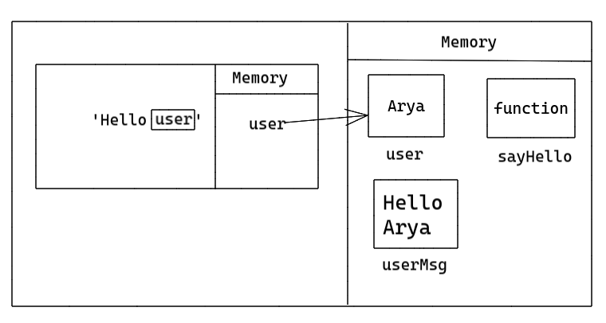
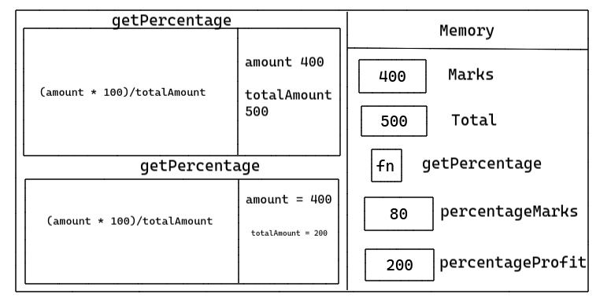
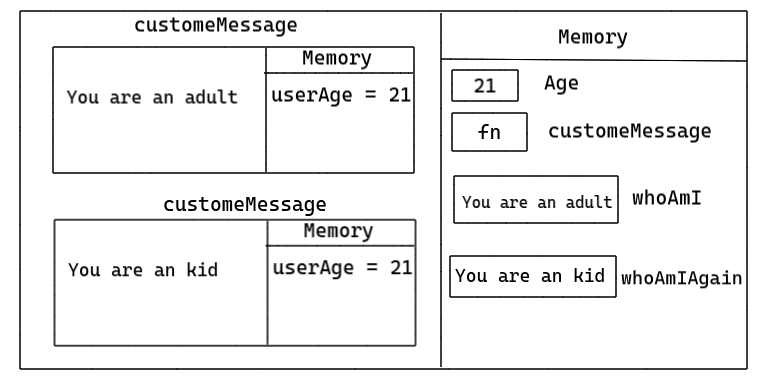

1. What does thread of execution means in JavaScript?

<!-- Executing code line by line is called thread of execution in JS -->

2. Where the JavaScript code gets executed?

<!-- JS code gets executed in an environment called global execution context -->

3. What does context means in Global Execution Context?

<!-- Global Execution Context in JS means the environment in which JS code gets executed -->

4. When do you create a global execution context.

<!-- When JS engine executes the JS code GEC gets created -->

5. Execution context consists of what all things?

<!-- EC contest of two parts - execution/computation part and memory part -->

6. What are the different types of execution context?

<!-- There are two types of EC first is global and second is functional -->

7. When global and function execution context gets created?

<!-- Global executed when the program starts executing and functional executed when the execution of a function starts -->

8. Function execution gets created during function execution or while declaring a function.

<!-- During the execution of the function -->


9. Create a execution context diagram of the following code on your notebook. Take a screenshot/photo and store it in the folder named `img`. Use `` to display it here.


```js
var user = "Arya";

function sayHello(){
  return `Hello ${user}`;
}

var userMsg = sayHello(user);
```

<!-- Put your image here -->




```js
var marks = 400;
var total = 500;

function getPercentage(amount, totalAmount){
  return (amount * 100) / totalAmount;
}

var percentageMarks = getPercentage(marks, total);
var percentageProfit = getPercentage(400, 200);
```

<!-- Put your image here -->




```js
var age = 21;

function customeMessage(userAge){
  if(userAge > 18){
    return `You are an adult`;
  }else {
    return `You are a kid`;
  }
}

var whoAmI = customeMessage(age);
var whoAmIAgain = customeMessage(12);
```

<!-- Put your image here -->

